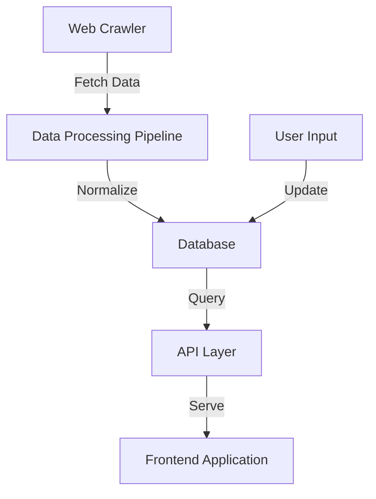
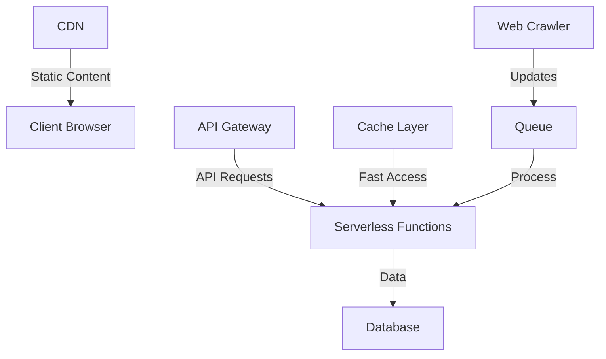

# Grant Route - Technical Documentation

## Architecture Overview

Grant Route is a modern web application built with React and TypeScript, designed to help startups discover and track government grants and incentives. This document outlines the technical architecture, deployment considerations, and scaling strategies.

### Tech Stack

- **Frontend**: React 18 + TypeScript
- **UI Framework**: Tailwind CSS + shadcn/ui
- **State Management**: TanStack Query (React Query)
- **Testing**: Vitest + React Testing Library
- **Build Tool**: Vite
- **Animation**: Tailwind CSS transitions + Framer Motion

### Key Components

1. **Dashboard System**
   - Modular component architecture
   - Real-time grant tracking
   - Notification system
   - Resource management

2. **Registration System**
   - Multi-step form architecture
   - Form validation
   - Data persistence

## Data Architecture

### Current Implementation
- Static data structures
- Mock data for demonstration
- Client-side filtering and search

### Planned AI Integration

1. **Web Crawler Integration**
   - Integration with Firecrawl API for automated grant discovery
   - Scheduled crawling of government websites
   - Data extraction and normalization pipeline

2. **Real-time Updates**
   - WebSocket integration for live notifications
   - Push notifications for new grants
   - Real-time eligibility updates

### Data Flow



## Scaling Strategy

### Infrastructure

1. **Static Content Delivery**
   - CDN deployment for static assets
   - Edge caching for API responses
   - Geographic distribution

2. **API Layer**
   - Serverless functions for API endpoints
   - Auto-scaling based on demand
   - Rate limiting and request throttling

3. **Database**
   - Distributed database system
   - Read replicas for scaling queries
   - Caching layer (Redis)

### Performance Optimizations

1. **Frontend**
   - Code splitting and lazy loading
   - Service Worker for offline capability
   - Progressive Web App (PWA) implementation

2. **Backend**
   - Batch processing for crawler data
   - Queue system for heavy operations
   - Caching strategies

## Monitoring and Analytics

1. **Performance Monitoring**
   - Real User Monitoring (RUM)
   - API performance tracking
   - Error tracking and reporting

2. **Business Analytics**
   - User engagement metrics
   - Grant discovery analytics
   - Application success tracking

## Security Considerations

1. **Data Protection**
   - End-to-end encryption for sensitive data
   - Regular security audits
   - GDPR compliance implementation

2. **Access Control**
   - Role-based access control (RBAC)
   - API authentication
   - Rate limiting

## Development Workflow

1. **Version Control**
   - Git-flow branching strategy
   - Automated CI/CD pipeline
   - Code review process

2. **Testing Strategy**
   - Unit tests for components
   - Integration tests for workflows
   - E2E tests for critical paths

## Future Enhancements

1. **AI Integration**
   - Grant matching algorithm
   - Eligibility prediction
   - Application success probability

2. **Automation**
   - Automated grant applications
   - Document generation
   - Status tracking

## Deployment Architecture



## Getting Started

### Prerequisites
- Node.js 18+
- npm or yarn
- Git

### Development Setup
```bash
# Clone repository
git clone https://github.com/your-org/grant-route.git

# Install dependencies
npm install

# Start development server
npm run dev

# Run tests
npm test

# Build for production
npm run build
```

### Environment Configuration
```env
NODE_ENV=development
API_URL=http://localhost:3000
CRAWLER_API_KEY=your_key_here
```

## API Documentation

### Grant Discovery API
```typescript
interface GrantResponse {
  id: string;
  name: string;
  description: string;
  eligibility: string[];
  deadline: Date;
  amount: number;
  status: 'open' | 'closed' | 'upcoming';
}

// Endpoint: /api/grants
// Method: GET
// Query Parameters:
// - page: number
// - limit: number
// - sector: string
// - location: string
```

### Notification API
```typescript
interface Notification {
  id: string;
  type: 'grant' | 'deadline' | 'update';
  message: string;
  timestamp: Date;
  priority: 'high' | 'medium' | 'low';
}

// Endpoint: /api/notifications
// Method: GET
// Headers:
// - Authorization: Bearer token
```

## Performance Benchmarks

- Time to First Byte (TTFB): < 200ms
- First Contentful Paint (FCP): < 1.5s
- Time to Interactive (TTI): < 3.5s
- Lighthouse Score: > 90

## Scaling Metrics

- Concurrent Users: Up to 100,000
- API Requests/Second: Up to 1,000
- Data Processing: Up to 1M grants/day
- Storage: Scalable to 10TB+

## Error Handling

1. **Frontend**
   - Global error boundary
   - Retry mechanisms for failed requests
   - Offline support

2. **Backend**
   - Request validation
   - Error logging and monitoring
   - Graceful degradation

## Maintenance

1. **Regular Tasks**
   - Database backups
   - Log rotation
   - Security updates
   - Performance monitoring

2. **Emergency Procedures**
   - Rollback procedures
   - Incident response plan
   - Data recovery process

## Support and Contact

For technical support or questions:
- Email: tech@grantroute.com
- Documentation: docs.grantroute.com
- GitHub: github.com/grantroute