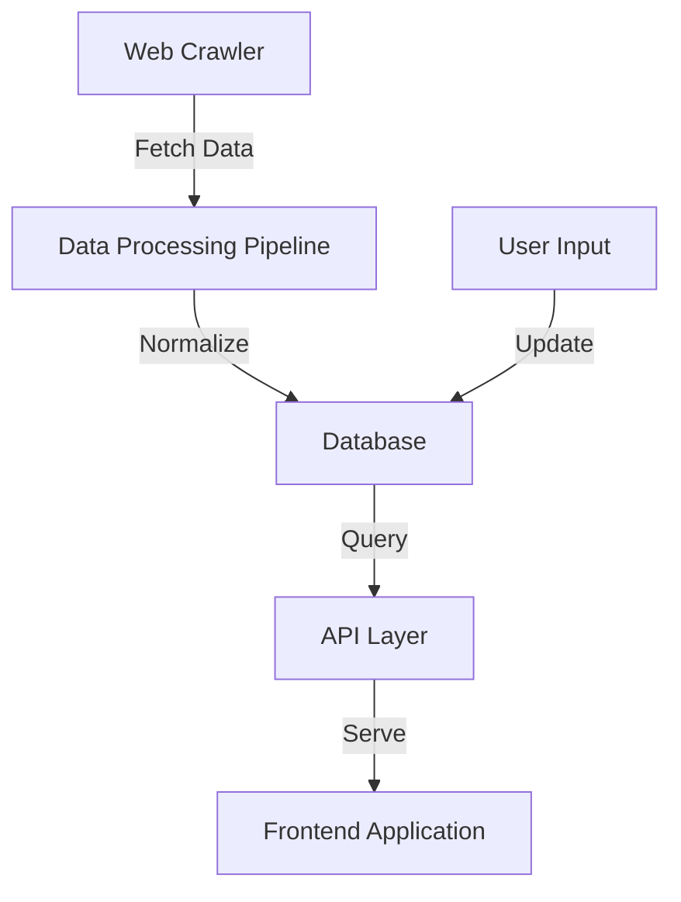
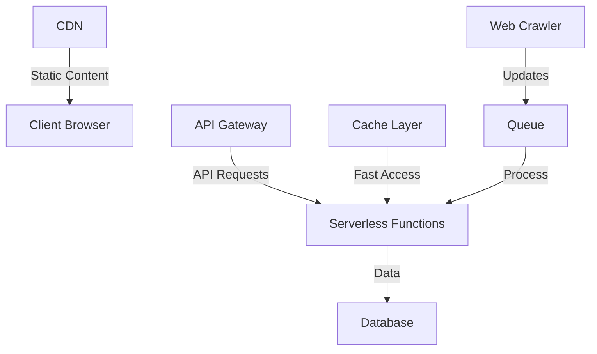

# Grant Route - Architecture Overview

## Tech Stack

- **Frontend**: React 18 + TypeScript
- **UI Framework**: Tailwind CSS + shadcn/ui
- **State Management**: TanStack Query
- **Testing**: Vitest + React Testing Library
- **Build Tool**: Vite
- **Animation**: Tailwind CSS transitions + Framer Motion

## Key Components

1. **Dashboard System**
   - Modular component architecture
   - Real-time grant tracking
   - Notification system
   - Resource management

2. **Registration System**
   - Multi-step form architecture
   - Form validation
   - Data persistence

## Data Flow

## Deployment Architecture

